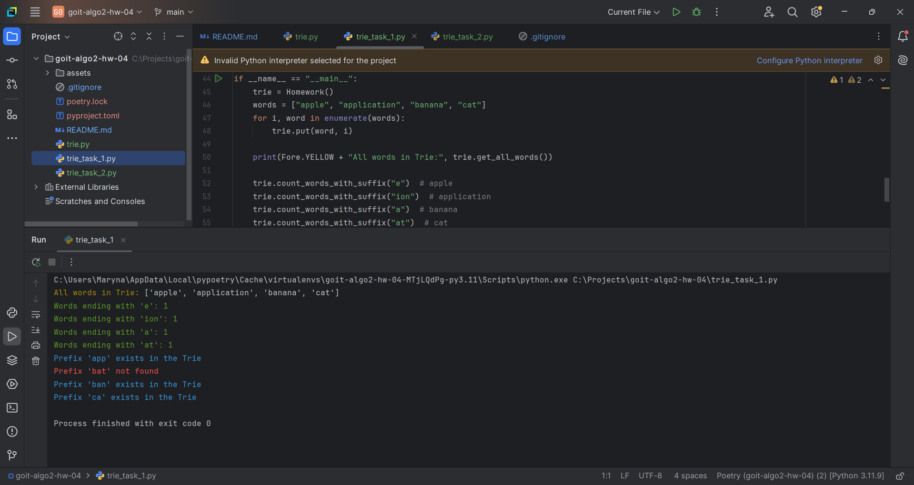
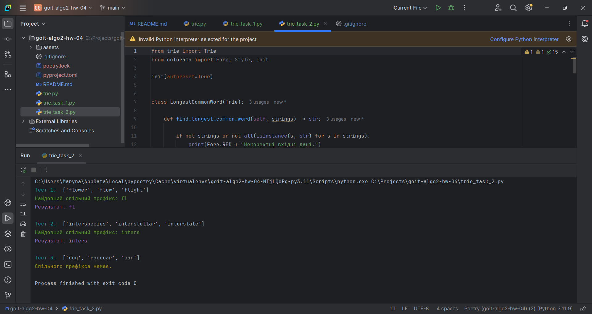

# HW-4 | "Prefix Trees"

Welcome to the homework on "Prefix Trees"! 🙂

This homework consists of two independent tasks.

By working with prefix trees through these practical exercises, you will discover 
a powerful tool for text data processing. Expanding the functionality of the Trie 
tree will help you not just learn the theory but also understand how this data 
structure aids in solving real-world search and text analysis tasks.

By implementing methods for handling suffixes and prefixes, you will see how
modern autocomplete and spell-checking systems work. The task of finding the
longest common prefix will teach you to optimize algorithms, considering both 
speed and memory usage.

Experience with prefix trees will become a reliable foundation for studying 
more complex algorithms and data structures, especially if you plan to work with 
natural language processing or search systems.

This is not just an educational exercise—it is a step toward understanding how 
modern text-processing systems, which we use daily, are built.

---

## Task 1. Expanding the Functionality of the Prefix Tree

Implement two additional methods for the `Trie` class:

- `count_words_with_suffix(pattern)`: Counts the number of words that end with 
the given pattern.
- `has_prefix(prefix)`: Checks if there are words with the given prefix.

### Technical Requirements

- The `Homework` class must inherit from the base `Trie` class.
- The methods must handle errors related to incorrect input data.
- Both methods' input parameters must be strings.
- The `count_words_with_suffix` method must return an integer.
- The `has_prefix` method must return a boolean value.


### Program Template

```python
from trie import Trie

class Homework(Trie):
    def count_words_with_suffix(self, pattern) -> int:
        pass

    def has_prefix(self, prefix) -> bool:
       pass

if __name__ == "__main__":
    trie = Homework()
    words = ["apple", "application", "banana", "cat"]
    for i, word in enumerate(words):
        trie.put(word, i)

    # Checking the number of words ending with the given suffix
    assert trie.count_words_with_suffix("e") == 1  # apple
    assert trie.count_words_with_suffix("ion") == 1  # application
    assert trie.count_words_with_suffix("a") == 1  # banana
    assert trie.count_words_with_suffix("at") == 1  # cat

    # Checking for prefix existence
    assert trie.has_prefix("app") == True  # apple, application
    assert trie.has_prefix("bat") == False
    assert trie.has_prefix("ban") == True  # banana
    assert trie.has_prefix("ca") == True  # cat
```
## Task 2. Finding the Longest Common Prefix

Create a `LongestCommonWord` class that inherits from `Trie` and implements 
the `find_longest_common_word` method, which finds the longest common prefix 
among all words in the input array of strings.

### Technical Requirements

- The `LongestCommonWord` class must inherit from `Trie`.
- The input parameter of the `find_longest_common_word` method, `strings`, 
is an array of strings.
- The `find_longest_common_word` method must return a string representing the 
longest common prefix.
- The time complexity is **O(S)**, where **S** is the total length of all 
strings.

### Acceptance Criteria

The `find_longest_common_word` method:

1. Returns the longest prefix common to all words. **(10 points)**
2. Returns an empty string if no common prefix exists. **(10 points)**
3. Correctly handles an empty array or incorrect input data. **(10 points)**
4. The code passes all tests. **(20 points)**

### Program Template

```python
from trie import Trie

class LongestCommonWord(Trie):

    def find_longest_common_word(self, strings) -> str:
        pass

if __name__ == "__main__":
    # Tests
    trie = LongestCommonWord()
    strings = ["flower", "flow", "flight"]
    assert trie.find_longest_common_word(strings) == "fl"

    trie = LongestCommonWord()
    strings = ["interspecies", "interstellar", "interstate"]
    assert trie.find_longest_common_word(strings) == "inters"

    trie = LongestCommonWord()
    strings = ["dog", "racecar", "car"]
    assert trie.find_longest_common_word(strings) == ""
```

# RESULTS

## TASK 1

## TASK 2
